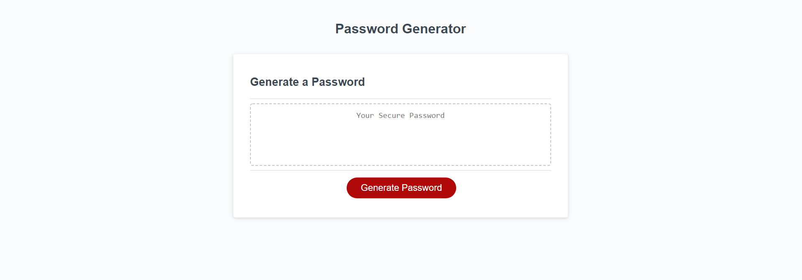

# Password Generator in JavaScript

Generates a random password based on selected attributes.

Attributes include:
Mandatory:
Number of characters: (8-128)

At least 1:
Lowercase letters
Uppercase letters
Numbers
Special characters: (!"#$%&'()\*+,-./:;&lt;=&gt;?@[\]^\_`{|}~)

### Website:

https://raymondcerneytech.github.io/JavaScript-Password-Generator/

### Preview:

